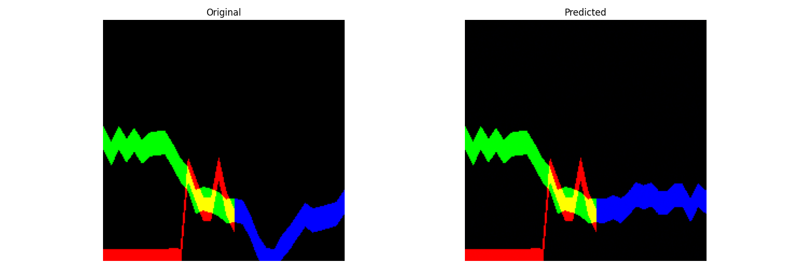

# Time Series Prediction (Generation) Diffusion Model

A conditional Denoising Diffusion Implicit Model (DDIM) that encodes stock price/volume time series as multi-channel RGB images and learns to generate the post-cutoff price channel from the pre-cutoff conditioning channels.


*Example test-set comparison: original vs. DDIM-generated channels for one trading-day sample (`test_results/comparisons/sample_0.png`).*

## Problem

Standard time-series forecasting models operate directly on numeric sequences. This project instead asks whether a stock's volume and price behavior can be represented as an image (one channel per signal) and whether a diffusion model can learn to fill in a missing channel — effectively treating "predict tomorrow's price movement" as an image-inpainting / conditional-generation problem.

## Approach

- **Data prep (`dataset_creation.py`)**: raw IBM stock data (`data/master_data_IBM.csv`, plus `batch1_IBM.csv` / `latest_data_IBM.csv`) is converted into per-day RGB images (see `stock_images/`), where:
  - Red channel = trading volume
  - Green channel = price changes *before* a cutoff time (conditioning signal)
  - Blue channel = price changes *after* the cutoff time (the signal the model must generate)
- **Model (`trainDDIM.py`)**: a conditional UNet (attention blocks, sinusoidal time embeddings, group norm, skip connections) is trained as a diffusion model. Only the blue (post-cutoff) channel is noised during training; the red/green channels are held fixed as conditioning input. Training runs for 10 epochs with an AdamW optimizer and an MSE noise-prediction loss (`training_DDIM.ipynb`).
- **Sampling**: at inference, DDIM sampling (configurable number of steps, `eta` for stochastic/deterministic trade-off) reconstructs the blue channel from noise, conditioned on the red/green channels of a held-out test sample.

## Result

Across the 9 evaluated test samples in `training_DDIM.ipynb`, the reconstructed (blue/post-cutoff) channel had a mean squared error of **≈0.21** against the ground-truth channel (range ≈0.05–0.30 across samples); the red/volume and green/pre-cutoff-price channels are conditioning inputs, not generated, so their MSE is trivially 0. This says the model reproduces the conditioning signal exactly (as expected) and gets closer-than-random but noisy results on the channel it actually has to generate — read as a proof-of-concept result, not a tuned forecasting benchmark.

Qualitative outputs for all 10 sampled test cases are in `test_results/comparisons/` (original vs. generated channels, e.g. `sample_0.png`–`sample_9.png`) and `test_results/intermediate_steps/` (denoising trajectory per sample, e.g. `sample_0_steps.png`–`sample_9_steps.png`). A presentation-style summary graphic is at `linkedin_visuals/linkedin_visualization.png`.

## How to run

```bash
git clone <repository-url>
cd DDIM_Time_Series
pip install -r requirements.txt

# 1. Place a CSV with timestamp/close/volume columns in data/, then build the RGB image dataset
python dataset_creation.py

# 2. Train the conditional DDIM (checkpoints saved every 10 epochs to checkpoints/)
python trainDDIM.py

# 3. Evaluate / sample: see training_DDIM.ipynb for the test_and_visualize() sampling and
#    comparison-plot cells that produced test_results/
```

Key model parameters (from `trainDDIM.py`): `n_timesteps=1000`, `base_channels=64`, `channel_mults=(1,2,4,8)`, `attention_resolutions=(8,16)`, `time_emb_dim=256`.

## License

Apache License 2.0 — see [`LICENSE`](LICENSE). Copyright 2026 Hojat Allah Salehi.

## Acknowledgments

This project builds on:
- DDIM (Denoising Diffusion Implicit Models)
- U-Net architecture
- Attention mechanisms in deep learning
